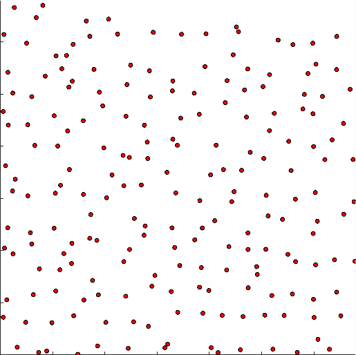
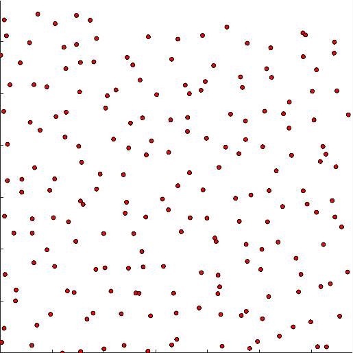
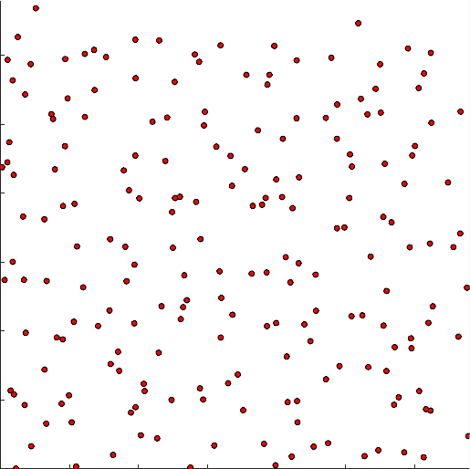
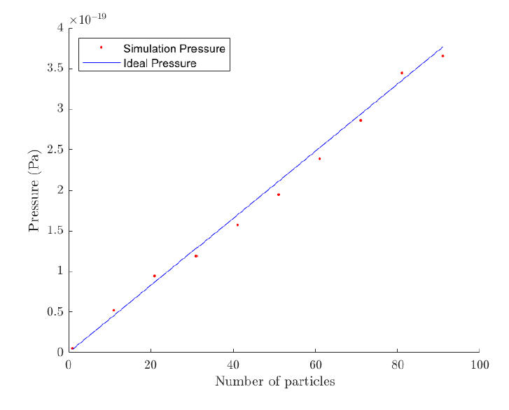

# interacting-particles
Simulation of Many Interacting Particles and their Thermodynamic Properties.

Since this project was completed as part of a university course (and the same project is run every year), the matlab code is not visible to the public. However, I've included some sample simulations as a guide of what was involved. A number of methods was used throughout the project, and is not limited to: using the 'Verlet' method for calculating positions/velocities/accelerations, using the 'boids' model to simulate flocking behaviour in particles in a 2-D box.

## Particle Interaction Simulation
Introduces interaction forces between particles in an Ideal Gas MATLAB simulation. In particular, a Lennard-Jones potential was chosen as it is considered a simple yet realistic model for intermolecular interactions. It describes soft repulsive and attractive interactions, meaning that it well represents electronically neutral atoms/molecules. A sample simulation can be seen below.

## Cooling Down Simulation
Introduces a cooling process into the Ideal Gas MATLAB simulation. A sample simulation can be seen below.

## Boids Simulation
The 'boids' model is a simple set of rules which attempts to simulate the flocking behaviour of birds. As an extension of the above investigation, we've applied these principles to particles in a 2-D box. A sample simulation can be seen below.

## Thermodynamic Properties
Apart from our direct simulations, we were also able to analyse some of the thermodynamic properties of interest. One example includes the relationship between the number of particles and the pressure against the wall/s of the 2-D box. A sample simulation can be seen below.

